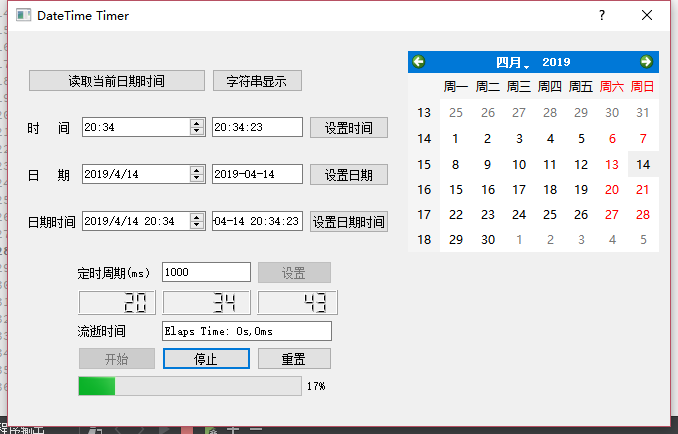

# Qt

> 各个小实验互不相干

## 电子秤

- 输入参数：数目num（float）、价格price（float）

- 输出参数：总和sum（float），保留两位小数

  

- Calculate(PushButton )：clicked后开始读取输入的参数并进行计算，将最终结果输入到界面。

## Login

- 一个登陆界面，需要输入自己预先设定的账户名及密码方可登录到主界面；
- 主界面现无任何内容；

## 时间显示&定时器

- 总体界面如下：

  

- 读取当前日期时间：，在时间框、日期框以及日期时间显示当前时间；

- 设置时间：将右侧字符串时间设置到左栏，实现手动改写；

- 设置日期：将右侧字符串日期设置到左栏；

- 设置日期时间：将右侧字符串日期时间设置到左栏；

- 定时周期：用于设置LCD屏的更新频率；

- 开始：开始计时；

- 停止：结束计时，并将持续时间写入到流逝时间；

- 重置：充值定时器的相关内容